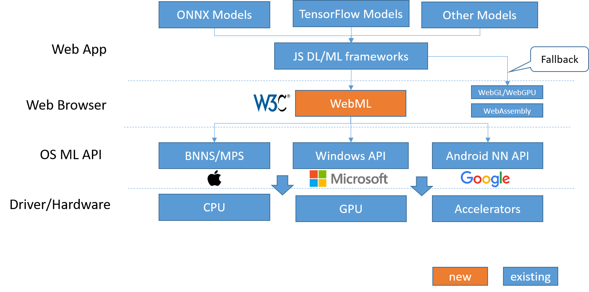

# WebML API Explained
## Introduction
WebML allows web developers to integrate machine learning (ML) models into web apps. With machine learning, web apps are able to deliver more intelligent user experiences, such as object detection and recognition, voice recognition, gesture recognition and style transformation etc.,.

WebML runs pre-trained ML models in web browser by using OS resources and taking advantages of CPU/GPU/accelerators on devices. WebML aims to provide maximum performance and efficiency which is essential for real-time applications, e.g. augmented reality. Together with progressive web apps, web apps using WebML can save network bandwidth and even remain functional and responsive when a network connection is unavailable.



## Use cases
Sentiment Analysis, Object Detection, Personalization, Style Transfer, Music Tagging, Gesture Recognition, Summarization, Translation, Scene Classification and Predicting text

Key advantages: real-time performance, save bandwidth, offline capability

| Sources | Use cases |
| --- | --- |
| Image/Video | Object detection and recognition, style transfer, translation, scene classification and gesture recognition |
| Audio | Voice recognition, music tagging, scene classification |
| Text | Predicting text, sentiment analysis |
| Sensor | Gesture recognition |
| AR | Augmenting scene with object detection, recognition or translation |

## Current related efforts

 * [WebDNN](https://mil-tokyo.github.io/webdnn/)
 * [keras.js](https://github.com/transcranial/keras-js)
 * [deeplearn.js](https://deeplearnjs.org/)

## Potential misuse
ML inference is an expensive operation due to the algorithmic complexity. Many requests, or demanding systems like a live stream feed with a certain frame rate, could slow down the whole system or greatly increase power consumption.

## Proposed IDL
### Navigator
```webidl
partial interface Navigator {
  readonly attribute ML ml;
};
```

### ML
```webidl
interface ML {
  NeuralNetworkContext getNeuralNetworkContext();
};
```

### NeuralNetworkContext
```webidl
interface NeuralNetworkContext {
  // Operand types.
  const long FLOAT32 = 0;
  const long INT32 = 1;
  const long UINT32 = 2;
  const long TENSOR_FLOAT32 = 3;
  const long TENSOR_INT32 = 4;
  const long TENSOR_QUANT8_ASYMM = 5;

  // Operation types.
  const long ADD = 0;
  const long AVERAGE_POOL_2D = 1;
  const long CONCATENATION = 2;
  const long CONV_2D = 3;
  const long DEPTHWISE_CONV_2D = 4;
  const long DEPTH_TO_SPACE = 5;
  const long DEQUANTIZE = 6;
  const long EMBEDDING_LOOKUP = 7;
  const long FLOOR = 8;
  const long FULLY_CONNECTED = 9;
  const long HASHTABLE_LOOKUP = 10;
  const long L2_NORMALIZATION = 11;
  const long L2_POOL_2D = 12;
  const long LOCAL_RESPONSE_NORMALIZATION = 13;
  const long LOGISTIC = 14;
  const long LSH_PROJECTION = 15;
  const long LSTM = 16;
  const long MAX_POOL_2D = 17;
  const long MUL = 18;
  const long RELU = 19;
  const long RELU1 = 20;
  const long RELU6 = 21;
  const long RESHAPE = 22;
  const long RESIZE_BILINEAR = 23;
  const long RNN = 24;
  const long SOFTMAX = 25;
  const long SPACE_TO_DEPTH = 26;
  const long SVDF = 27;
  const long TANH = 28;

  // Fused activation function types.
  const long FUSED_NONE = 0;
  const long FUSED_RELU = 1;
  const long FUSED_RELU1 = 2;
  const long FUSED_RELU6 = 3;

  // Implicit padding algorithms.
  const long PADDING_SAME = 1;
  const long PADDING_VALID = 2;

  // Execution preferences.
  const long PREFER_LOW_POWER = 0;
  const long PREFER_FAST_SINGLE_ANSWER = 1;
  const long PREFER_SUSTAINED_SPEED = 2;

  Promise<Model> createModel();
};
```

### Model
```webidl
interface Model {
  void addOperand(OperandOptions options);
  void setOperandValue(unsigned long index, ArrayBufferView data);
  void addOperation(long type, sequence<unsigned long> inputs, sequence<unsigned long> outputs);
  void identifyInputsAndOutputs(sequence<unsigned long> inputs, sequence<unsigned long> outputs);
  Promise<long> finish();
  Promise<Compilation> createCompilation();
};
```

### Compilation
```webidl
interface Compilation {
  void setPreference(long preference);
  Promise<long> finish();
  Promise<Execution> createExecution();
};
```

### Execution
```webidl
interface Execution {
  void setInput(unsigned long index, ArrayBufferView data);
  void setOutput(unsigned long index, ArrayBufferView data);
  Promise<long> startCompute();
};
```

## Platform specific implementation notes

### Mac OS X / iOS
 * [CoreML](https://developer.apple.com/documentation/coreml)
 * [BNNS](https://developer.apple.com/documentation/accelerate/bnns)
 * [MPS](https://developer.apple.com/documentation/metalperformanceshaders)

### Android
 * [TensorFlow Lite](https://www.tensorflow.org/mobile/tflite/)
 * [NNAPI](https://developer.android.com/ndk/guides/neuralnetworks/index.html)

### Windows
To be added

### Other libraries
 * [MKL-DNN](https://github.com/intel/mkl-dnn)
