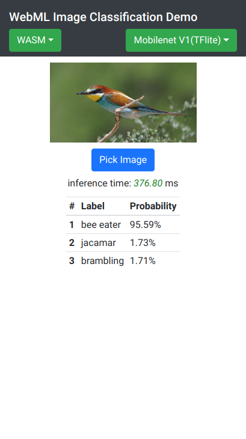

## WebNN API Image Classification Example
This example loads Image classification models trained by ImageNet, constructs and inferences it by WebNN API.

### Download Model
Before launch this example, you need to download the model. Please check out [README.md](model/README.md) in model folder for details.

### Screenshot

### URL Parameters for Image Classification Example
E.g. 
https://127.0.0.1/examples/image_classification/index.html?prefer=none&b=WASM&m=mobilenet_v1&t=tflite&s=image&d=0

#### Description
| Parameter | Value | Description | Note |
|----|------|------|-----------|
| prefer | sustained, fast, low | Preferred backend for WebNN API backend sustained == GPU fast == CPU low == Low Power |Only work for WebNN API backend, useless when backend is WASM or WebGL |
| b | WASM, WebGL, WebML | Backend | Case sensitive |
| m | // for tflite format  mobilenet_v1, mobilenet_v2, squeezenet, inception_v3, inception_v4, inception_resnet_v2   // for onnx format  mobilenet_v2, squeezenet, resnet_v1, resnet_v2, inception_v2, densenet| Model and it's version ||
| t | tfile onnx| Model format  | |
| s | image  camera | Show image or camera tab directly | |
| d | 0, 1  | Display model // full view  0 // compact view 1  | |

### Netron URLs
It supports to use Netron Visualizer for deep learning and machine learning models in [model.html](../model.html), please upload [these models](model/README.md) to your website (or CDN/OSS services).