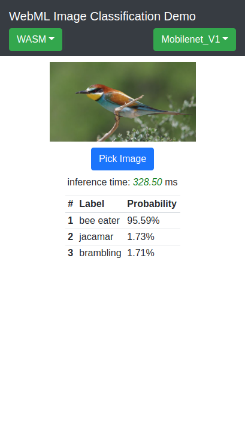

WebML Image classification Sample
======
This sample loads Image classification models trained by ImageNet in TensorFlow Lite format, constructs and inferences it by WebML API.

Download Model
-----------
Before launch this sample, you need to download the model. Please check out [README.md](model/README.md) in model folder for details.

Screenshots
-----------
