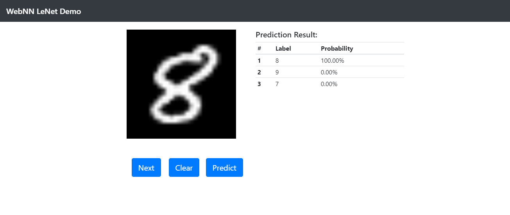

## WebNN API LeNet Example
The sample uses the LeNet classifications network as an example.

### Download Model
Please download the [lenet.bin](https://github.com/openvinotoolkit/openvino/blob/2020/inference-engine/samples/ngraph_function_creation_sample/lenet.bin) before launch the example.

### Screenshot
