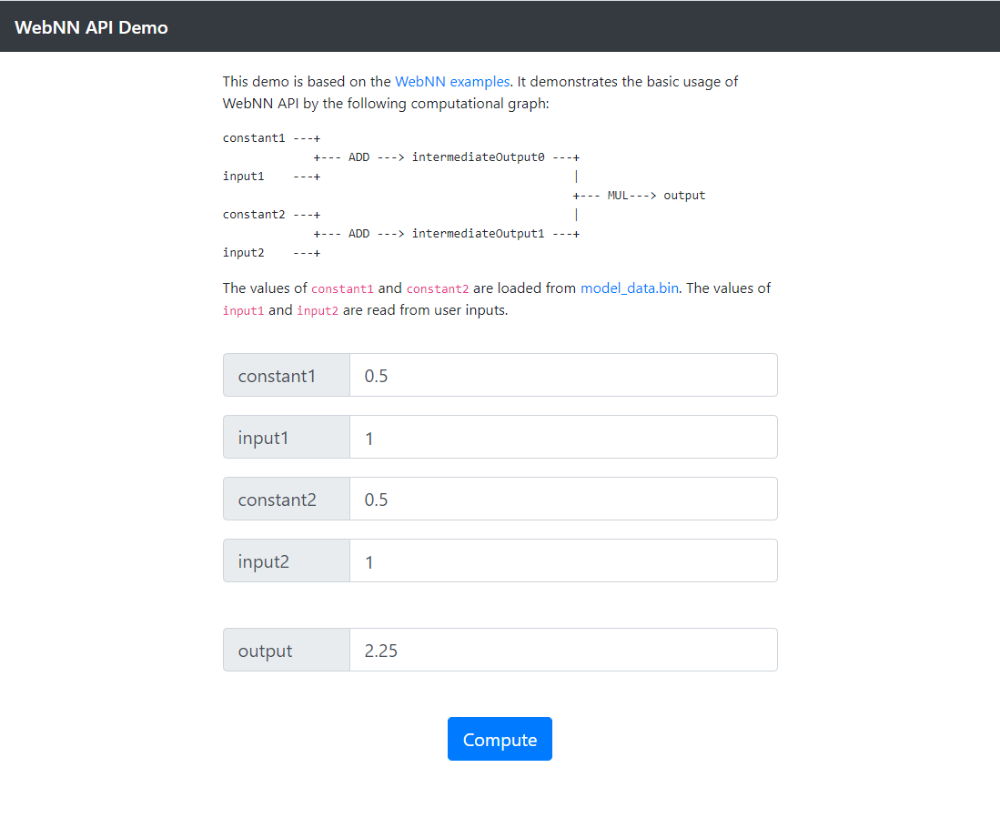

WebNN API Demo
======
This demo is based on the [WebNN examples](https://webmachinelearning.github.io/webnn/#examples). It demonstrates the basic usage of WebNN API by the following computational graph:

```js
constant1 ---+
             +--- ADD ---> intermediateOutput0 ---+
input1    ---+                                    |
                                                  +--- MUL---> output
constant2 ---+                                    |
             +--- ADD ---> intermediateOutput1 ---+
input2    ---+
```

The values of `constant1` and `constant2` are loaded from [model_data.bin](model_data.bin). The values of `input1` and `input2` are read from user inputs.

Screenshots
-----------
