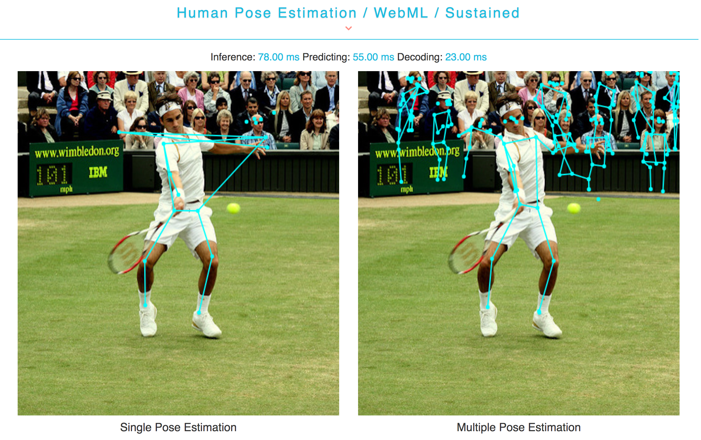

# WebNN API PoseNet Example   
This example loads a pretrained posenet model, constructs and infers it by WebNN API.  

## Screenshot   

       
## Usage        
PoseNet can be used to estimate either a single pose or multiple poses, so there are two versions, one is for single pose detection with an assumption that is there exists only one persion in image or video, another one is for multiple poses detection used to detect several person poses. At the same time, there are various parameters shown in above control pad could affect PoseNet model's accuracy and cost time.    
 
    
***Model: 1.01/1.0/0.75/0.5***       
The larger the value, the larger the size of the layers, and more accurate the model at the cost of speed. Set this to a smaller value to increase speed at the cost of accuracy.    
`1.01`/`1.0`: Computers with powerful GPUs   
`0.75`: Computers with mid-range/lower-end GPUs   
`0.5`: Mobile      
    
***OutputStride: 8/16/32***     
The desired stride for the output, it decides output dimension of model. The higher the number, the faster the performance but slower the accuracy.  
     
***Scale Factor: (0.1, 1)***    
Scale down the image size before feed it through model, set this number lower to scale down the image and increase the speed when feeding through the network at the cost of accuracy.     
    
***Score Threshold:***    
Score is the probability of keypoint and pose, set score threshold higher to reduce the number of poses to draw on image and visa versa.    
          
***nmsRadius:***       
The minimal distance value between two poses under multiple poses situation. The smaller this value, the poses in image are more concentrated.   
       
***maxDetection:***    
The maximul number of poses to be detected in multiple poses situation.     
## Algorithm      
Single Pose Detection Reference: [**Blog**](https://medium.com/tensorflow/real-time-human-pose-estimation-in-the-browser-with-tensorflow-js-7dd0bc881cd5)            
       
Multiple Pose Detection Reference: [Person Pose Estimation and Instance Segmentation with a Bottom-Up, Part-Based, Geometric Embedding Model](https://arxiv.org/abs/1803.08225)       
## Reference    
https://github.com/tensorflow/tfjs-models/tree/master/posenet
