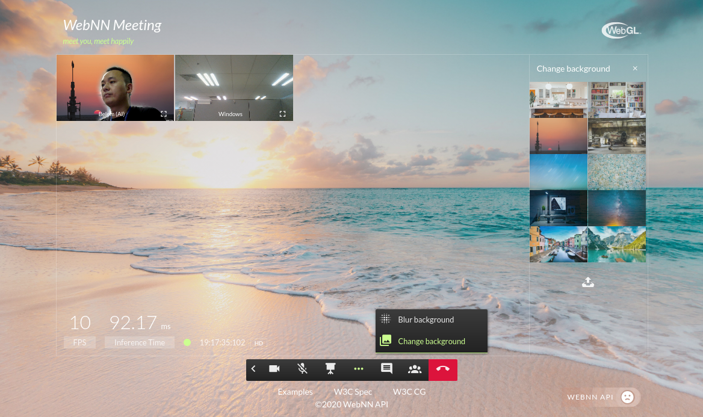
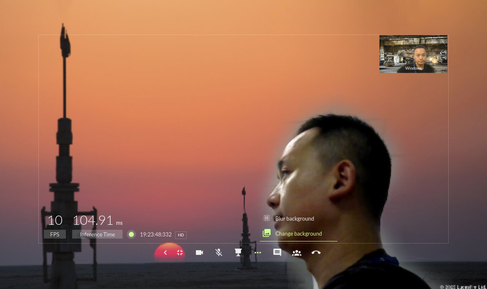

# WebNN Meeting (Intelligent Collaboration)

A Web-based Intelligent Collaboration (Video Conference) example with AI features based on W3C Web Neural Network API and powered by Intel Open WebRTC Toolkit (OWT).

> [Web Neural Network (WebNN) API](https://webmachinelearning.github.io/webnn/) is a dedicated low-level API for neural network inference hardware acceleration. It is published by the [W3C Machine Learning for the Web Community Group](https://www.w3.org/community/webmachinelearning/).

## Web Machine Learning Features

- Blur my background
- Change my background
- More to come

## Normal Video Conference Features

- Video and audio
- Screen sharing
- Conversation / Text message
- ...

## Screenshot




## Supported Backends for Web Machine Learning Features

- Slowest: WebAssembly (WASM)
- Slower: WebGL (Will upgrade to WebGPU later)
- Fastest: Web Neural Network (WebNN) API 

Mordern browsers including Google Chrome doesn't support WebNN API now, you can try WebGL backend automatically with your browser. 

### Optional

If you are interested, please refer to [WebNN Chromium build repo](https://github.com/otcshare/chromium-src) and WIKI: 

- How to build WebNN Chromium on [Windows](https://github.com/intel/webml-polyfill/wiki/How-to-build-chromium-on-Windows), [Linux](https://github.com/intel/webml-polyfill/wiki/How-to-build-chromium-on-Linux)
- [How to run Chromium builds with WebNN API](https://github.com/intel/webml-polyfill/wiki/How-to-Run-Chromium-builds-with-WebNN-API).

## Precondition - Intel Open WebRTC Toolkit (OWT) Server Setup

The WebNN Meeting requires WebRTC server support, please read [Server.md](doc/Server.md) for setting up Intel Open WebRTC Toolkit (OWT) Server on CentOS* 7.6 or Ubuntu 18.04 LTS.

## HTTPS Configuration

Go to project main dir like `/home/belem/github/webnnmeeting` and create private and public key, the certificate path need to be filled in `certificate`.`key` and `certificate`.`cert` of `config.js`.

```
$ openssl genrsa 2048 > webnnmeeting.key
$ chmod 400 webnnmeeting.key
$ openssl req -new -x509 -nodes -sha256 -days 365 -key webnnmeeting.key -out webnnmeeting.crt
```

## Environment Configuration

Please update configurations in `config.js` under main folder.

In 'Launch the OWT Server as Single Node' section of [Open WebRTC Toolkit (OWT) Server Setup](doc/Server.md), you could get values of `webrtcserver`.`id`, `webrtcserver`.`key` and `webrtcserver`.`url` like `xxx.xxx.xxx.xxx` or `https://<webrtcserver.com>`.

Run following commands,

```
$ npm install
$ node server/meetingserver.js
``` 
you could get the sampleRoom id like `5df9d3661b3282c0ef1a5ee3` in command line log for `restapiserver`.`sampleroomparticipantspath`.

Update `config.js` with correct data:


```
  webrtcserver: {
    id: '5df9ca6f7415937c7a91d774',
    key:
      'rGtTQokQM/OeG/9oDzK9TtFjd+OOeUmFN2dZl52mvaI4cSj1waduIJB8x21Wa9MaGqtZzV1KTWBvr7heBIgSjQjQyeBWI0RFzCTSyhFtd9jmZ994xE50Gkmb2zxkQYALef8oj8do3gT/cWfOfgq1zPooCkRtbMK1xm44Avduyj4=',
    url: 'https://xxx.xxx.xxx.xxx',
    port: '3000',
    restapiport: '3004'
  },
  restapiserver: {
    host: '127.0.0.1',
    httpport: 8082,
    httpsport: 8081,
    sampleroomparticipantspath: '/rooms/5df9d3661b3282c0ef1a5ee3/participants'
  },
  nuxtserver: {
    host: '0.0.0.0',
    httpsport: 8888
  },
  certificate: {
    cert: './webnnmeeting.crt',
    key: './webnnmeeting.key'
  }
```


## Build Setup

``` bash
# install dependencies
$ npm install

# serve with hot reload at localhost:3000
$ npm run dev

# build for production and launch server
$ npm run build
$ npm run start

# generate static project
$ npm run generate
```

## Port Conflict

If error happens related to port conflict, you could change ports in `config.js`.

## How to Run

If you are running the code locally, the browser will show "Your connection is not private" when accessing Intel OWT server and WebNN Meeting web pages.

- Visit https://xxx.xxx.xxx.xxx:8080/socket.io/?EIO=3&transport=polling
- Click "Advanced" button -> Click "Proceed to xxx.xxx.xxx.xxx (unsafe)"
- Visit WebNN Meeting URL set in config.js, e.g: https://127.0.0.1:8888/
- Click "Advanced" button -> Click "Proceed to 127.0.0.1 (unsafe)"

### Models

If you get the WebNNMeeting source code from https://github.com/intel/webml-polyfill, please download model files from [semantic_segmentation/model](https://github.com/intel/webml-polyfill/tree/master/examples/semantic_segmentation/model) and put them (e.g. deeplab_mobilenetv2_257_dilated.tflite) under `./static/js/webnn/ss/model/`

### macOS

Once you are using macOS and it says "Your connection is not private", click somewhere on the page and then blindly type `thisisunsafe` which will instantly bypass the warning.

## License

The License of WebNN Meeting will be Apache 2.0.

## Code Hacks

There are some code hacks in Intel Open WebRTC Toolkit (OWT) and Material Design Icons, please refer to [code hacks](doc/CodeHacks.md).

## Error Handling

If you encounter the error `ENOSPC: System limit for number of file watchers reached, watch`  when build the project on Ubuntu, please try: 

```
echo fs.inotify.max_user_watches=524288 | sudo tee -a /etc/sysctl.conf && sudo sysctl -p
```