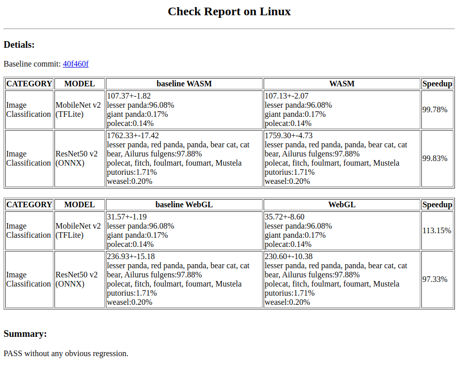

# Workload Automation Test Toolkit
This is an automation toolkit to test workload for efficiently collecting performance data of supported backend (not including IE-MYRIAD) on Windows and Linux platforms, besides, it would be used to do regression checking for developers when submitting Web ML API PRs with high quality.

## Prerequisites
For testing IE Inference backends (IE-clDNN, IE-MKLDNN), you need follow these guides to install OpenVINO and setup OpenVINO environment:

* Install OpenVINO of 2020.3.194 version

  [Install Intel® Distribution of OpenVINO™ toolkit for Linux*](https://docs.openvinotoolkit.org/latest/openvino_docs_install_guides_installing_openvino_linux.html)

  [Install Intel® Distribution of OpenVINO™ toolkit for Windows* 10](https://docs.openvinotoolkit.org/latest/openvino_docs_install_guides_installing_openvino_windows.html)


* Set the Environment Variables

  For Linux platform
  ```sh
  source /opt/intel/openvino/bin/setupvars.sh
  ```

  For Winows platform
  ```sh
  cd C:\Program Files (x86)\IntelSWTools\openvino\bin\
  setupvars.bat
  ```

## Install
```sh
npm install
```

## Set Configurations
Please refer to the comments to modify some variables of 'Part A (Must Modify)' in ./settings.js file, and optional modify some variables of 'Part B'.

* Must modify
  ```js
  // Sample url for WORKLOAD_URL: http(s)://<test-server-ip or test-server-hostname>:<port>/workload/
  WORKLOAD_URL = "modify_workload_url";

  // Sample url for NIGHTLY_BUILD_URL: http://<build-server-hostname>/project/webnn/nightly/
  NIGHTLY_BUILD_URL = "modify_nightly_url";

  // This password is required for testing on Linux platform
  // to use for installation and uninstallation chromium
  LINUX_PASSWORD = "modify_password";
  ```
* Modify for Regression Checking
  ```js
  // Set REGRESSION_FLAG to be true and modify DEV_CHROMIUM_PATH for Regression Test
  REGRESSION_FLAG = true;

  // 1) Path sample of linux '/path/chromium-browser-unstable_86.0.4209.0-1_amd64.deb'
  // 2) Path sample of windows 'C:\\path\\Chrome-bin\\chrome.exe'
  DEV_CHROMIUM_PATH = 'modify_chromium_path';
  ```

## Run Workload Test

```sh
npm start
```

## Run Regression Checking
Since baseline data were generated on specified test devices (called baseline-devices for next reference), if you do regression checking on your device not same as baseline-devices, those existed baseline would be not accurate for comparing and analyzing, you could run this command:

```sh
npm run rc
```

or if you already had latest baseline data of your device, you could run this command (rcs means rc in short time)

```sh
npm run rcs
```

## Other Command Tools

Download chromium build of latest/specified version into ./output/chromiumBuild/<commit>/<platform>_x64_SUCCEED folder.
```js
npm run downloadbuild
```

Install chromium build after above download step
```js
npm run installbuild
```

Compare Result CSV files

* Explicit Compare:
  ```js
  npm run compare /path/<file-name>.csv /path/<baseline-file-name>.csv
  ```

* Implicit Compare

  Compare input result CSV file with exisited baseline CSV file ./output/report/baseline/baseline-<platform>.csv or ./baseline/baseline-<platform>.csv if ./output/report/baseline/baseline-<platform>.csv doesn't exist.
  ```js
  npm run compare /path/<file-name>.csv
  ```
  equals to
  ```js
  npm run compare /path/<file-name>.csv ./output/report/baseline/baseline-<platform>.csv
  ```
  or equals to (if ./output/report/baseline/baseline-<platform>.csv doesn't exist)
  ```js
  npm run compare /path/<file-name>.csv ./baseline/baseline-<platform>.csv
  ```

## Baseline
./baseline/baseline-linux.csv and ./baseline/baseline-windows.csv saved in ./baseline folder were from stable test result data of latest chromium build.

## Test Result
* For Workload Test

  Test result CSV file is saved in ./output/report/<commit>result-<platform>-<timestamp>.csv, likes: ./output/report/40f460f/result-linux-2020090301091212.csv

* For Regression Checking

  Test result CSV file is saved in ./output/report/dev/result-<platform>.csv and test report HTML file is saved in ./output/report/check-report.html

  Here's is sample result report HTML page:

  
